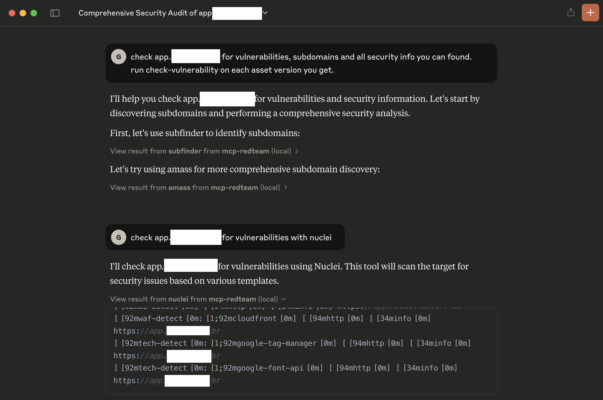
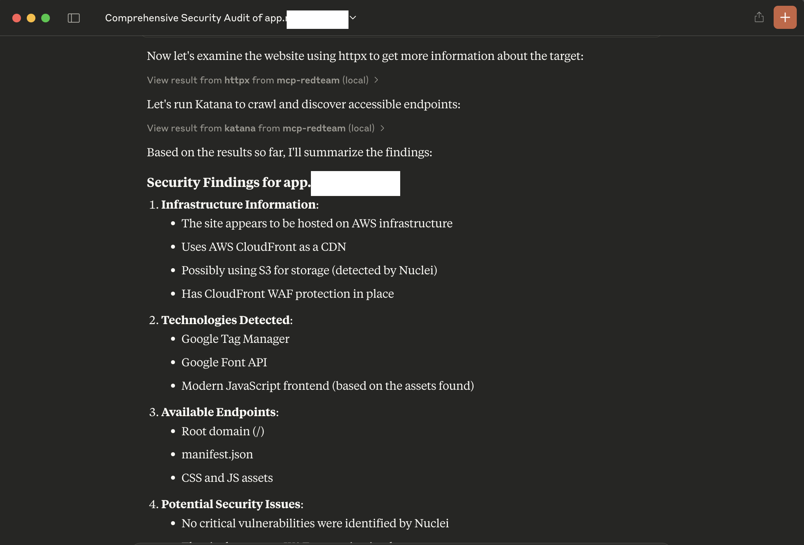
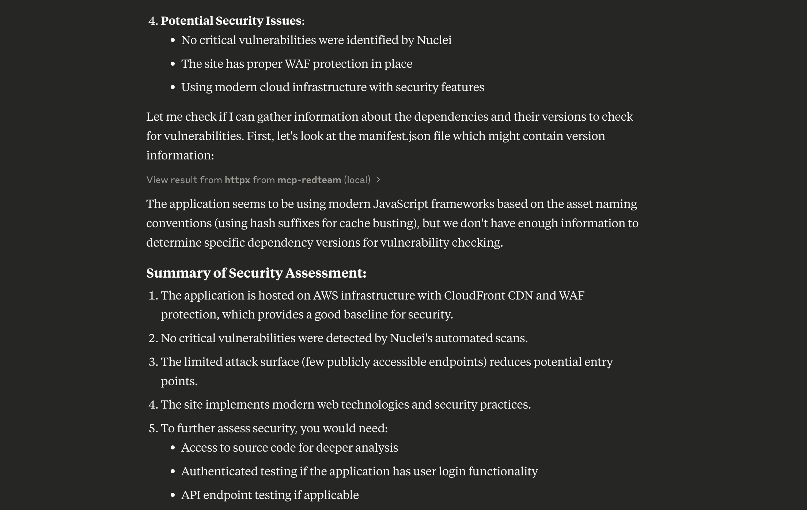
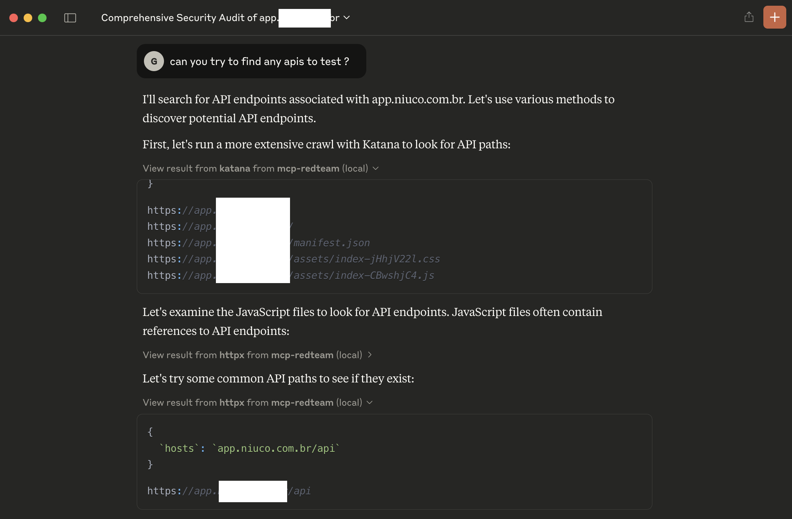
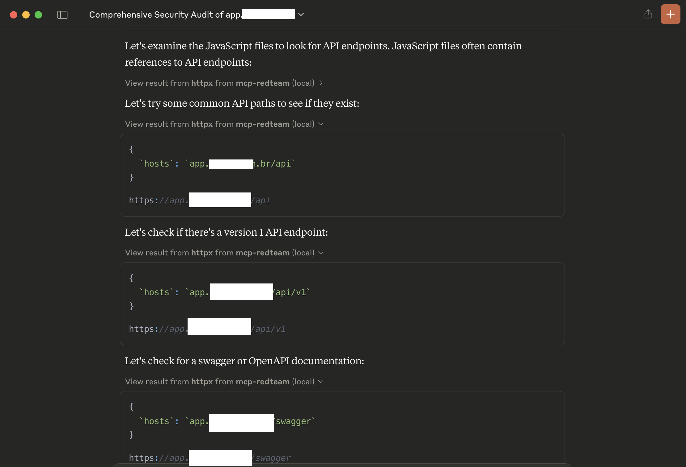
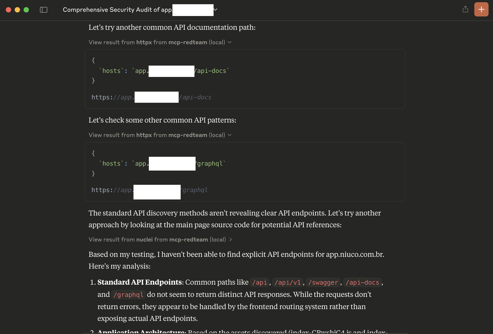
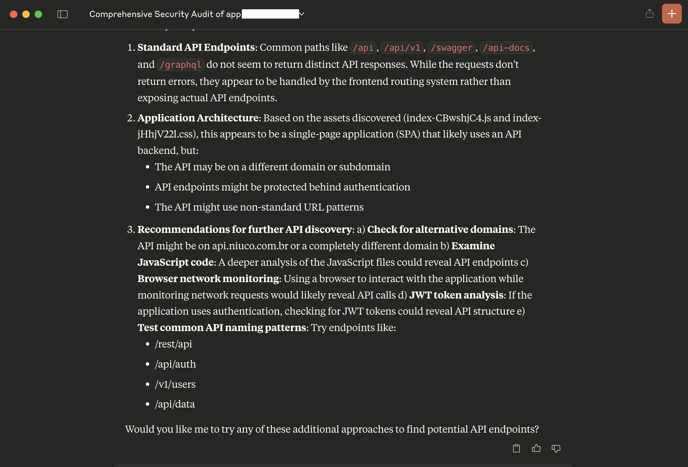

# MCP-RedTeam

MCP-RedTeam is a Model Context Protocol (MCP) implementation for red team and reconnaissance commands. It provides a framework for executing security tools in a controlled and reproducible manner.

## Features

- **Tool Registry**: A centralized registry for managing security tools with metadata and dependencies
- **Pipeline System**: YAML-based pipeline definitions for chaining multiple tools together
- **Process Management**: Robust process handling with timeouts and resource limits
- **Embedded Templates**: Pipeline templates are embedded in the binary, eliminating the need for external configuration files
- **Natural Language Processing**: Convert natural language prompts into executable pipelines
- **Comprehensive Reporting**: Detailed reports of pipeline execution results

## Screenshots








## Tools

The project supports the following security tools:

- **subfinder**: Subdomain finder
- **amass**: Subdomain enumeration and attack surface mapping
- **httpx**: Fast and multi-purpose HTTP toolkit
- **dnsx**: Fast and multi-purpose DNS toolkit
- **katana**: Crawler optimized for security testing
- **nuclei**: Vulnerability scanner based on templates
- **semgrep**: Static analysis tool for finding bugs
- **shodan**: Internet-connected device search engine
- **fofa**: Network space mapping and asset discovery
- **report**: Reporting and visualization tools

### Installation

The project includes a Makefile for easy installation and management of dependencies:

```bash
# Install Go dependencies
make deps

# Install CLI tools on macOS (requires Homebrew)
make install-macosx-commands

# Install CLI tools on Linux (Debian-based distributions)
make install-linux-commands

# Build the binary
make build

# Install the binary to /usr/local/bin
make install
```

Available Makefile targets:
- `all`: Build the binary (default target)
- `deps`: Install Go dependencies
- `test`: Run tests
- `build`: Build the binary
- `install`: Install the binary to /usr/local/bin
- `install-macosx-commands`: Install CLI dependencies using Homebrew (macOS)
- `install-linux-commands`: Install CLI dependencies using apt (Linux)
- `clean`: Clean build artifacts
- `run`: Build and run the binary
- `help`: Show help message

## Usage

### Basic Usage

```go
// Create a new MCP client
client, err := client.NewStdioMCPClient("go", nil, "run", "main.go")
if err != nil {
    log.Fatal(err)
}
defer client.Close()

// Initialize the client
initReq := mcp.InitializeRequest{}
initReq.Params.ProtocolVersion = mcp.LATEST_PROTOCOL_VERSION
initReq.Params.ClientInfo = mcp.Implementation{
    Name:    "mcp-test-client",
    Version: "1.0.0",
}

if _, err := client.Initialize(ctx, initReq); err != nil {
    log.Fatal(err)
}

// Execute a pipeline
pipelineArgs := map[string]interface{}{
    "template": "recon.yaml",
    "params": map[string]string{
        "domain": "example.com",
    },
}

callReq := mcp.CallToolRequest{
    Request: mcp.Request{Method: "tools/call"},
}
callReq.Params.Name = "pipeline"
callReq.Params.Arguments = pipelineArgs

result, err := client.CallTool(ctx, callReq)
if err != nil {
    log.Fatal(err)
}
```

### Natural Language Prompts

You can use natural language to generate and execute pipelines:

```go
promptReq := mcp.CallToolRequest{
    Request: mcp.Request{Method: "tools/call"},
}
promptReq.Params.Name = "plan-and-execute"
promptReq.Params.Arguments = map[string]interface{}{
    "prompt": "scan example.com for vulnerabilities",
}

result, err := client.CallTool(ctx, promptReq)
if err != nil {
    log.Fatal(err)
}
```

## Development

### Adding New Tools

To add a new tool to the registry:

1. Create a new tool handler with metadata
2. Register the tool in the main function
3. Add appropriate tests

Example:

```go
tool := &ToolHandler{
    Metadata: ToolMetadata{
        Name:         "new-tool",
        Description:  "New security tool",
        Timeout:      5 * time.Minute,
        RequiredArgs: []string{"arg1"},
    },
    Handler: newToolHandler,
}

if err := toolRegistry.Register(tool); err != nil {
    log.Fatal(err)
}
```

### Creating New Pipeline Templates

1. Create a new YAML file in the `pipeline_templates` directory
2. Define the pipeline structure with tasks and parameters
3. Add appropriate tests

Example:

```yaml
name: New Pipeline
description: A new pipeline template

tasks:
  - name: Task 1
    tool: tool1
    args:
      param1: "{{param1}}"
  - name: Task 2
    tool: tool2
    args:
      param2: "{{param2}}"
```

## Testing

Run the test suite:

```bash
go test -v ./...
```

## Security Considerations

- All external tool executions are sandboxed with timeouts and resource limits
- Process groups are used to ensure proper cleanup of child processes
- Input validation is performed on all tool arguments
- Dependencies are validated before tool registration

## License

This project is licensed under the MIT License - see the LICENSE file for details. 